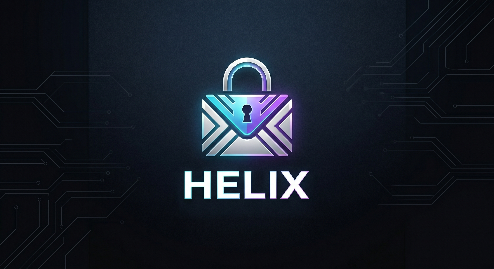

<p align="center">
  
</p>

# Helix

Helix is a privacy-focused, cross-platform email client built on a single
codebase: direct IMAP/POP3/SMTP connections to mail providers (no
middleman sync servers), local encryption, and a dark-mode-first,
customizable UI. Desktop first, with mobile (iOS/Android) planned via the
same React Native component tree.

## Status

Early development -- not usable as a daily-driver email client yet. The
desktop shell has a fully designed three-pane interface (account/folder
sidebar, message list, reader pane), but the frontend is still wired to
sample data rather than the real backend commands.

The Rust backend is further along: working IMAP connection/login, folder
listing, message fetching (headers and body), SMTP sending, provider
auto-discovery, and OS-keychain credential storage. See
[`docs/technical/backend-backlog.md`](docs/technical/backend-backlog.md)
for the detailed checklist of what's implemented vs. still planned, and
[`docs/user/overview.md`](docs/user/overview.md) for a user-facing
description of the current build.

## Tech stack

- **Frontend:** React Native Web (components written against the RN API,
  rendered via `react-native-web`; no actual React Native runtime in the
  desktop build), Vite, TypeScript
- **Backend/shell:** Tauri 2 (Rust) -- `async-imap`, `lettre` (SMTP),
  `keyring` (OS-native credential storage), `tokio`

## Getting started

Prerequisites (Linux): Node.js v22+, the Rust toolchain via
[rustup](https://rustup.rs), Tauri's native build dependencies, and a
running Secret Service provider (gnome-keyring or KWallet) for credential
storage. See [`docs/technical/setup.md`](docs/technical/setup.md) for
exact package names and macOS/Windows notes.

```
npm install              # install JS dependencies
npm run tauri dev         # full app: compiles the Rust shell, opens a native window, hot reload
npm run dev               # Vite dev server only (browser, no native shell)
npm run build              # production web build
npm run tauri build        # production desktop build/installer
```

## Testing

```
cd src-tauri
cargo test                # unit tests only; network/Docker-dependent tests are #[ignore]d
cargo test -- --ignored    # run the ignored tests (needs a real IMAP server or local GreenMail --
                           # see docs/technical/imap-core.md for the Docker invocation)
```

There is no frontend test runner or linter/formatter config set up yet.

## Documentation

- [`docs/user/`](docs/user) -- what Helix is, current status, how to run it
- [`docs/technical/`](docs/technical) -- architecture, stack-choice
  rationale, setup, and per-feature implementation notes (credential
  storage, IMAP core, SMTP, provider discovery, account onboarding)

## License

Not yet finalized. Helix is intended to be published as an open-source
project; a license will be added before the first public release.
